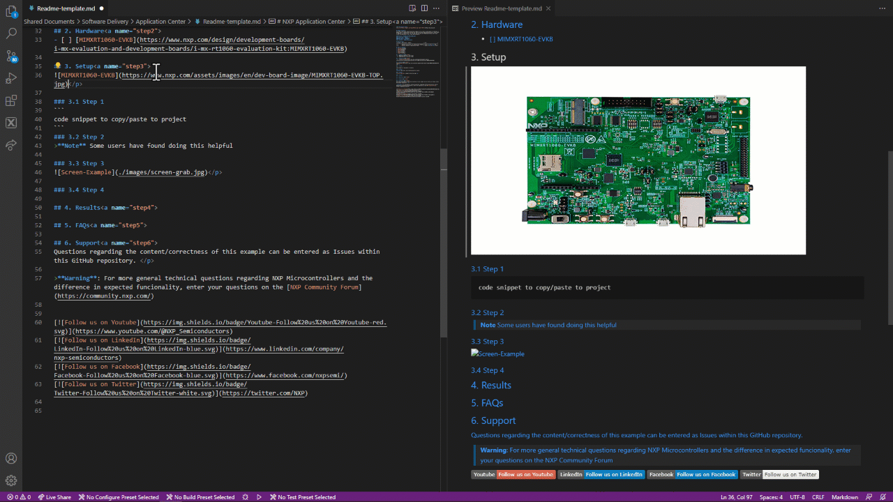

[](https://www.nxp.com)

## Bubble Peripheral
The bubble level demo demonstrates basic usage of the on-board accelerometer to implement a bubble level. A bubble level utilizes two axes to visually show deviation from a level plane (0 degrees) on a given axis. You can open the mex file with MCUXpresso Config Tool to do further configuration of pin, clock and peripheral.

#### Project Metadata
<!----- Devices ----->
[](https://github.com/search?q=org%3ANXP-mcuxpresso+RT1060+in%3Areadme&type=Repositories)
[](https://github.com/search?q=org%3ANXP-mcuxpresso+LPC55S69+in%3Areadme&type=Repositories)
[](https://github.com/search?q=org%3ANXP-mcuxpresso+MCX9N+in%3Areadme&type=Repositories+org:nxp)
[](https://github.com/search?q=org%3ANXP-mcuxpresso+K22F+in%3Areadme&type=Repositories)
</p>

<!----- Technologies ----->
[](https://github.com/search?q=RT1060+in%3Areadme&type=Repositories)
[](https://github.com/search?q=RT1060+in%3Areadme&type=Repositories)
[](https://github.com/search?q=RT1060+in%3Areadme&type=Repositories)
</p>

<!----- Applications ----->
[](https://github.com/search?q=RT1060+in%3Areadme&type=Repositories)
</p>

<!----- Peripherals -----> 
[](https://github.com/search?q=RT1060+in%3Areadme&type=Repositories)
[](https://github.com/search?q=RT1060+in%3Areadme&type=Repositories)
</p>

<!----- Toolchains ----->  
[](https://github.com/search?q=RT1060+in%3Areadme&type=Repositories)
[](https://github.com/search?q=RT1060+in%3Areadme&type=Repositories)
</p>

## Release notes
| Version | Description / Update                           | Date                        |
|:-------:|------------------------------------------------|----------------------------:|
| 1.1     | Updated instructions for seting up the example | March 3<sup>rd</sup> 2023   |
| 1.0     | Initial release on Application Center          | January 1<sup>st</sup> 2023 |

## Table of Contents
1. [Software](#step1)
1. [Hardware](#step2)
1. [Setup](#step3)
1. [Results](#step4)
1. [FAQs](#step5) 
1. [Support](#step6)

## 1. Software<a name="step1">
- [ ] MCUXpresso SDK v2.13.0 or later
- [ ] Toolchains Supported
    - IAR embedded Workbench  9.30.1
    - Keil MDK  5.37
    - GCC ARM Embedded  10.3.1
    - MCUXpresso  11.6.0

## 2. Hardware<a name="step2">
- [ ] [MIMXRT1060-EVKB](https://www.nxp.com/design/development-boards/i-mx-evaluation-and-development-boards/i-mx-rt1060-evaluation-kit:MIMXRT1060-EVKB)
- [ ] Mini/micro USB cable
- [ ] Personal Computer

## 3. Setup<a name="step3">
No special board settings are required.</p>
</p>

### 3.1 Prepare the Demo
1.  Connect a USB cable between the host PC and the OpenSDA USB port on the target board.
2.  Open a serial terminal with the following settings:
    - 115200 baud rate
    - 8 data bits
    - No parity
    - One stop bit
    - No flow control
3.  Download the program to the target board.
4.  Either press the reset button on your board or launch the debugger in your IDE to begin running the demo.

### 3.1 Step 2
To properly setup the device copy the following into terminal: </p>
```
code snippet to copy/paste to project
```
### 3.2 Step 3
>**Note** Some users have found doing this helpful
### 3.3 Step 4
You can see how to complete this step in following video:</p>
 </p>

## 4. Running the demo<a name="step4">
When the example runs successfully, you can see the similar
information from the terminal as shown below.

~~~~~~~~~~~~~~~~~~~~~
Welcome to the BUBBLE example

You will see the change of LED brightness when change angles of board

x=  6 y = 22
x=  8 y = 26
x= 10 y = 28
x= 10 y = 28
x= 11 y = 29
x= 11 y = 29
~~~~~~~~~~~~~~~~~~~~~

## 5. FAQs<a name="step5">
- If the user LED flashes constantly and the following message is printed on the console:
    Sensor device initialize failed!

    Please check the sensor chip U32

  please check if the combo sensor (U32) is presented on the board.
  
## 6. Support<a name="step6">
Questions regarding the content/correctness of this example can be entered as Issues within this GitHub repository. </p>
>**Warning**: For more general technical questions regarding NXP Microcontrollers and the difference in expected funcionality, enter your questions on the [NXP Community Forum](https://community.nxp.com/).


[](https://www.youtube.com/@NXP_Semiconductors)
[](https://www.linkedin.com/company/nxp-semiconductors)
[](https://www.facebook.com/nxpsemi/)
[](https://twitter.com/NXP)
